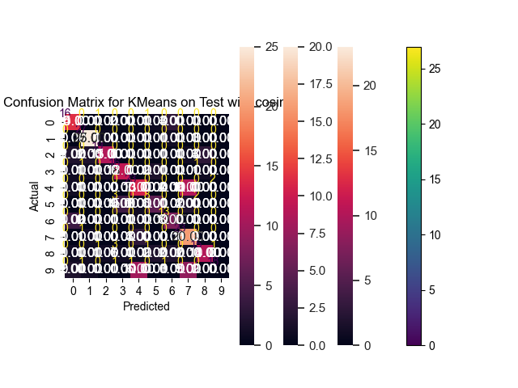
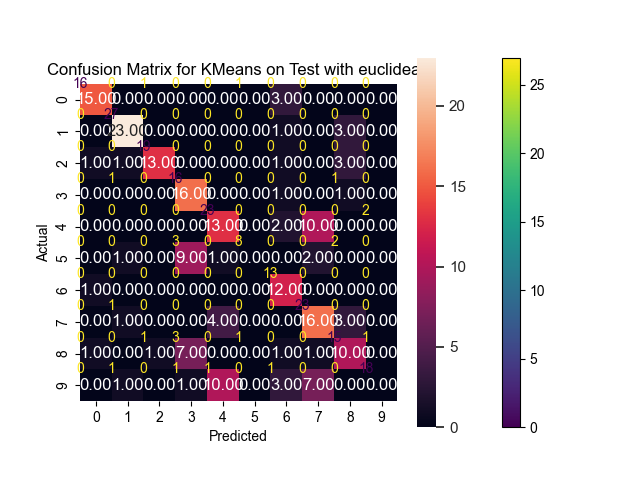
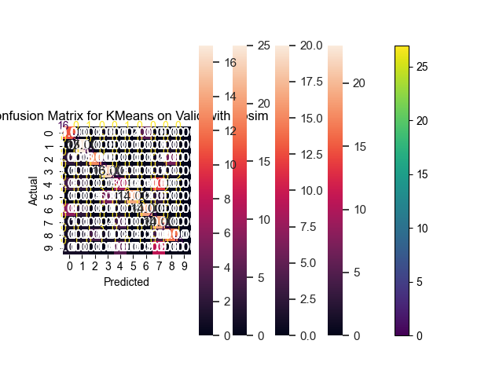

# Part 3 - KMeans
**Q3. Implement a k-means classifier in the same manner as described above for the k-nearest neighbors classifier. 
The labels should be ignored when training your k-means classifier. 
Describe your design choices and analyze your results in about one paragraph each.**

**Design choices** :-
1. Under the assumption that it is an MNIST dataset, we have taken a default of  k = 10 clusters to correspond with the numbers 0-9. Increasing the value of k improves the accuracy but since the underlying assumption was MNIST with 10 clusters, we have kept that constant
2. Hyperparameter = max_iter to ensure that the algorithm converges and time complexity is managed by this.
3. Scaling = minmax scaling which seemed to boost the performance of the clusters by increasing the accuracy when tested with the true labels (Other scaling methods tested - dividing the greyscale values by 255 to obtain them in a range of 0-1).
4. PCA (Principal Component Analysis) = To expedite convergence due to the extensive dimensionality of our distance metrics computation (x * 784), we employed PCA (Principal Component Analysis). This reduced the dimensionality, leading to a substantial decrease in clustering time. For KNN, we chose to use enough principal components to explain 95% of the variability in the training set.
5. Transform cosine similarity range = We transformed cosine similarity to a 1-cosim value to make it a more intuitive distance metric for obtaining clusters.
6. Performing validation = The classification accuracies are obtained using the true labels provided in the dataset. In essence, the logic of using the most frequent occurrence (the mode) in the validation process allows the code to assess how effectively the KMeans clustering algorithm has grouped data points of the same actual label together. If the clusters largely consist of data points with the same actual label, then the accuracy will be high.
7. Empty cluster handling = if for a particular iteration a cluster is empty i.e. no samples were assigned during training, we reinitialize the mean of the empty cluster to a random data point 
8. Convergence criteria = converge if centroids are not different in 2 iterations. 

**Results**

**Analysis**.

1. After generating the confusion matrices on test and valid with both matrices, certain clusters seem to have high true positive counts i.e. they have been correctly classified.
2. The general precision across clusters seems to be fairly high as evident by the classification reports.
3. For the confusion matrix generated on test set with euclidean, we have notable correct predictions (with relatively high values) for classes 0 (15 correct predictions), 1 (25 correct predictions), 4 (12 correct predictions), 7 (18 correct predictions), and 8 (13 correct predictions).
4. However, there are certain misclassifications made, which might be due to the random initialization of the means when the initial clustering happens. Since this is unsupervised learning, the model doesn't necessarily learn the most meaningful clusters, but the ones that emerge empirically.
5. Cluster 5 in particular does not capture any true positives. Clusters 5 seems to have been classified majorly into 8 and 3.
6. Overall accuracy : while precision and recall is higher for most classes, the overall accuracy is brought down by the misclassifications.
7. Distance metric: Euclidean gave a slightly better accuracy than the transformed cosine distance metric for Kmeans.
8. Consistency : We see a consistency in classifications across the test and validation sets and with both distance metrics.
9. Kmeans: while the majority of predictions lie on the main diagonal, which suggests that the classifier does have a reasonable performance for several classes, but there's still room for improvement.

